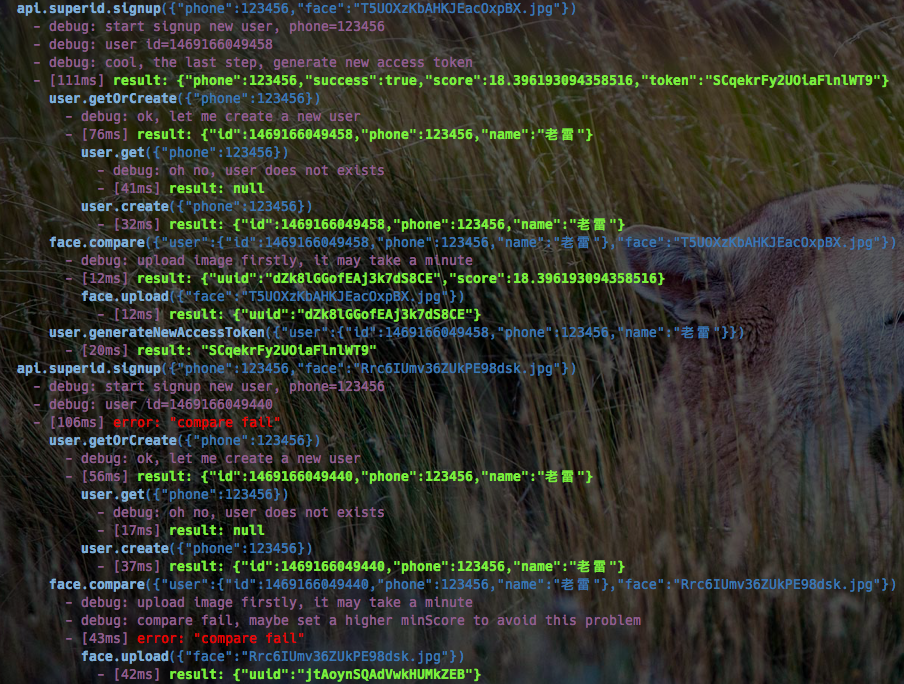

[![NPM version][npm-image]][npm-url]
[![build status][travis-image]][travis-url]
[![Test coverage][coveralls-image]][coveralls-url]
[![David deps][david-image]][david-url]
[![node version][node-image]][node-url]
[![npm download][download-image]][download-url]
[![npm license][license-image]][download-url]

[npm-image]: https://img.shields.io/npm/v/nanoservices.svg?style=flat-square
[npm-url]: https://npmjs.org/package/nanoservices
[travis-image]: https://img.shields.io/travis/SuperID/nanoservices.svg?style=flat-square
[travis-url]: https://travis-ci.org/SuperID/nanoservices
[coveralls-image]: https://img.shields.io/coveralls/SuperID/nanoservices.svg?style=flat-square
[coveralls-url]: https://coveralls.io/r/SuperID/nanoservices?branch=master
[david-image]: https://img.shields.io/david/SuperID/nanoservices.svg?style=flat-square
[david-url]: https://david-dm.org/SuperID/nanoservices
[node-image]: https://img.shields.io/badge/node.js-%3E=_4.0-green.svg?style=flat-square
[node-url]: http://nodejs.org/download/
[download-image]: https://img.shields.io/npm/dm/nanoservices.svg?style=flat-square
[download-url]: https://npmjs.org/package/nanoservices
[license-image]: https://img.shields.io/npm/l/nanoservices.svg

# nanoservices
比微服务更小的纳米服务框架

## 安装

```bash
$ npm install nanoservices --save
```

**要求 Node.js v4.0.0 或更高版本**


## 设计目标

+ [x] 将项目代码服务化，每一个「纳米服务」完成一个小功能
+ [x] 通过`requestId`来跟踪记录完整的调用链
+ [x] 自动记录日志，结合相应的调试信息方便开发调试
+ [ ] 考虑接驳`clouds`系统，可以使得不同主机/进程间的调用也适用




## 使用方法

```javascript
'use strict';

const { Manager } = require('nanoservices');

// 创建管理器
const services = new Manager();


// 注册服务
services.register('add', function (ctx) {
  // ctx.params 为输入的参数，该对象已冻结不能对其更改
  // ctx.error(err) 返回出错信息
  // ctx.result(ret) 返回调用结果
  // ctx.debug(msg) 输出调试信息

  if (isNaN(ctx.params.a)) return ctx.error('参数a不是一个数值');
  if (isNaN(ctx.params.b)) return ctx.error('参数a不是一个数值');

  ctx.debug('add: a=%s, b=%s', ctx.params.a, ctx.params.b);

  const a = Number(ctx.params.a);
  const b = Number(ctx.params.b);

  // 返回结果
  ctx.result(a + b);
});


// 调用服务
services.call('add', { a: 123, b: 456 }, (err, ret) => {
  if (err) {
    console.error(err);
  } else {
    console.log('result=%s', ret);
  }
});
```


## Context对象

服务的处理函数只接收一个参数，该参数为一个`Context`对象，通过该对象完成读取参数、返回结果等所有操作。

`Context`对象结构如下：

```typescript
interface Context {

  // 请求ID
  requestId: string;

  // 调用开始时间
  startTime: Date;

  // 执行结束时间
  stopTime: Date;

  // 耗时（毫秒）
  spent: number;

  // 参数对象，该对象已被冻结，不能在对象上做修改
  params: Object;

  // 返回执行结果
  result(ret: any);

  // 返回执行出错
  error(err: any);

  // 打印调试信息，支持 debug('msg=%s', msg) 这样的格式
  debug(msg: any);

  // 调用其他服务
  // 如果没有传递 callback 参数则返回 Promise
  call(name: string, params: Object, callback: (err, ret) => void): Promise;

  // 顺序调用一系列的服务，上一个调用的结果作为下一个调用的参数，如果中途出错则直接返回
  // 如果没有传递 callback 参数则返回 Promise
  series(calls: [CallService], callback: (err, ret) => void): Promise;

  // 调用服务器，该调用的结果作为当前服务的执行结果返回
  transfer(name: string, params: Object);

  // 顺序调用一系列的服务，上一个调用的结果作为下一个调用的参数，如果中途出错则直接返回
  // 最后一个调用的结果将作为当前服务的执行结果返回
  transferSeries(calls: [CallService], callback: (err, ret) => void);

  // 返回一个 CallService 对象，与 series() 结合使用
  // params 表示绑定的参数，如果补指定，则使用上一个调用的结果
  prepareCall(name: string, params?: Object);

}
```


## 调用链

各个服务之间的调用会通过传递`requestId`来记录调用来源以及整个调用链结构（请求参数、返回结果等），
还可以通过`debug()`方法来打印调试信息，这些信息会根据需要记录到日志文件中，
只要通过`requestId`即可查询到完整的调用信息。

### 在服务外部调用多个服务

默认情况下使用`services.call()`会自动生成一个`requestId`并调用服务，但调用方无法获得这个`requestId`，
我们可以通过`services.newContext()`来获得一个新的`Context`对象：

```javascript
// 创建Context
const ctx = services.newContext();
// 如果要自定义requestId，可以这样：
// const ctx = services.newContext(requestId);

// 调用服务
ctx.call('add', { a: 1, b: 2 }, (err, ret) => {
  if (err) return console.error(err);
  console.log(ret);

  // 调用第二个服务
  ctx.call('devide', { a: 123, b: 456 }, (err, ret) => {
    if (err) return console.error(err);
    console.log(ret);

    // ...
  });
});
```

### 顺序调用多个服务

有时候某个服务实际上是通过顺序调用一系列服务来完成操作的，可以使用`ctx.series()`方法：

```javascript
ctx.series([

  // 第一个服务必须手动绑定调用参数，因为它没有上一个服务调用结果可用
  ctx.prepareCall('add', { a: 123, b: 456 }),

  ctx.prepareCall('divide'),
  ctx.prepareCall('times'),

], (err, ret) => {
  if (err) {
    ctx.error(err);
  } else {
    ctx.result(ret);
  }
});
```


## 日志

默认情况下，服务调用产生以及服务执行期间所产生的日志调试信息是不会被记录的。可以在初始化`Manager`时可以传入一个`logRecorder`参数，
以便将这些日志信息记录到指定的位置。目前支持`stream`和`logger`两种方式。

1、`stream`方式如下：

```javascript
const { Manager, StreamRecorder } = require('nanoservices');

// 将日志记录到标准输出接口
const stream = process.stdout;

// 创建LogRecorder
const logRecorder: new StreamRecorder(stream, {
  newLine: '\n',
  format: '$date $time $type $id $content',
});

// 创建Manager
const services = new Manager({ logRecorder });
```

在创建`StreamRecorder`时，第一个参数`stream`为一个标准的`Writable Stream`，可以通过`fs.writeWriteStream()`或`TCP`网络的可写流；
第二个参数为一些选项，比如：

+ `newLine`表示换行符，即每条日志都会自动在末尾加上这个换行符，如果不指定则表示不加换行符
+ `format`表示日志格式，其中有以下变量可选：
  + `$id` - 当前`requestId`
  + `$service` - 当前服务名称，如果没有则为`null`
  + `$uptime` - 当前`context`已启动的时间（毫秒）
  + `$date` - 日期，如`2016/08/02`
  + `$time` - 时间，如`14:01:37`
  + `$datetime` - 日期时间，如`2016/08/02 14:01:37`
  + `isotime` - ISO格式的时间字符串，如`2016-08-12T13:20:27.599Z`
  + `$timestamp` - 毫秒级的Unix时间戳，如`1470980387892`
  + `$timestamps` - 秒级的Unix时间戳，如`1470980387`
  + `$type` - 日志类型，目前有以下几个：`debug, log, error, call, result`
  + `$content` - 内容字符串
  + `$pid` - 当前进程PID
  + `$hostname` - 当前主机名

2、`logger`方式如下：

```javascript
const { Manager, LoggerRecorder } = require('nanoservices');

// 一个日志记录器
const logger = console;
// 由于console没有debug方法，需要模拟一个
logger.debug = console.log;

// 创建LogRecorder
const logRecorder: new LoggerRecorder(logger, {
  format: '$date $time $type $id $content',
});

// 创建Manager
const services = new Manager({ logRecorder });
```

在创建`LoggerRecorder`时，第一个参数`logger`为一个包含了`info, log, debug, error`这四个方法的日志记录器；
第二个参数为一些选项，比如`format`，其使用方法与上文的`StreamRecorder`相同，但默认值与前者不同。

`ctx.log()`会使用`logger.log()`来记录，`ctx.debug()`使用`logger.debug()`，
`ctx.error()`使用`logger.error()`，其他的均使用`logger.info()`来记录。

通过记录服务调用日志等信息，再结合相应的日志分析系统即可实现调试跟踪等功能。


## License

```
The MIT License (MIT)

Copyright (c) 2016 SuperID | 免费极速身份验证服务

Permission is hereby granted, free of charge, to any person obtaining a copy
of this software and associated documentation files (the "Software"), to deal
in the Software without restriction, including without limitation the rights
to use, copy, modify, merge, publish, distribute, sublicense, and/or sell
copies of the Software, and to permit persons to whom the Software is
furnished to do so, subject to the following conditions:

The above copyright notice and this permission notice shall be included in all
copies or substantial portions of the Software.

THE SOFTWARE IS PROVIDED "AS IS", WITHOUT WARRANTY OF ANY KIND, EXPRESS OR
IMPLIED, INCLUDING BUT NOT LIMITED TO THE WARRANTIES OF MERCHANTABILITY,
FITNESS FOR A PARTICULAR PURPOSE AND NONINFRINGEMENT. IN NO EVENT SHALL THE
AUTHORS OR COPYRIGHT HOLDERS BE LIABLE FOR ANY CLAIM, DAMAGES OR OTHER
LIABILITY, WHETHER IN AN ACTION OF CONTRACT, TORT OR OTHERWISE, ARISING FROM,
OUT OF OR IN CONNECTION WITH THE SOFTWARE OR THE USE OR OTHER DEALINGS IN THE
SOFTWARE.
```
